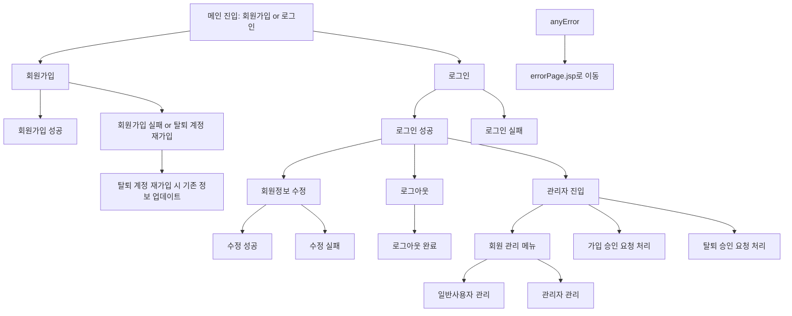
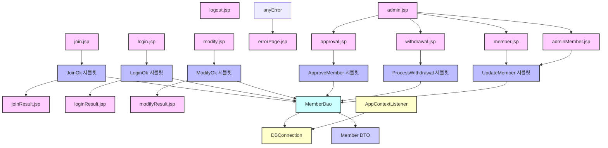

# JSP_20강

> 💡 목표: JSP 기반 회원 기능 구현 웹 프로젝트

## 작업 범위
- [x] 사용자 관리 기능
  - [x] 회원 가입
  - [x] 로그인
  - [x] 로그아웃
  - [x] 회원정보 수정
  - [x] 아이디 기억하기 (쿠키)
- [x] 화면 결과 처리
  - [x] 회원가입 성공/실패 화면
  - [x] 로그인 성공/실패 화면
  - [x] 회원정보 수정 성공/실패 화면
  - [x] 로그아웃 완료 화면
  - [x] 예외 발생 시 전용 에러 페이지 출력
- [x] 관리자 페이지 기능
  - [x] 관리자 전용 대시보드 (`admin.jsp`) 구현
  - [x] 일반 사용자/관리자 구분 관리
  - [x] 가입 승인 요청 처리 (ST00 → ST01)
  - [x] 탈퇴 승인 요청 처리 (ST03 → ST02 or ST01)
  - [x] 계정 상태/전화번호/회원 유형 정보 수정 기능
  - [x] 계정 상태가 '해지(ST02)'인 경우 수정 불가 처리
- [x] 부가 기능
  - [x] JDBC 드라이버 정상 해제 (AppContextListener 적용)
  - [x] 모든 화면 중앙 카드형 레이아웃 디자인 적용
  - [x] 비밀번호/휴대폰 번호 클라이언트 및 서버 유효성 검사
  - [x] 탈퇴한 유저 재가입 처리 (레코드 재사용 방식)

## 실행 방법
1. DB 접속을 위한 `DBConnection.java` 수정
    - Oracle Cloud Wallet을 이용하여 DB 접속 설정
2. Maven 빌드
     - `pom.xml`에 `ojdbc11-full` 의존성 추가
3. Tomcat 서버 실행
4. 브라우저 접속
    - `http://localhost:8080/jsp_19_sgnr/login.jsp` → 로그인 시작

## 실행 환경
- 운영체제: macOS Sequoia 15.3.1
- JDK 버전: OpenJDK 23.0.1
- 빌드 도구: Maven
- WAS: Apache Tomcat 11.0.6
- 데이터베이스: Oracle Cloud DB
- 외부 라이브러리: OJDBC11-full

## 프로그램 흐름

# 코드 구조

# 특이사항
- 관리자 기능 구현
    - 관리자 전용 페이지(admin.jsp)를 통해 다음 기능 수행
        - 회원 관리: 일반 사용자/관리자 구분하여 상태 및 정보 수정
        - 가입 승인: ST00 상태 사용자 승인
        - 탈퇴 승인: ST03(일시정지) 상태 사용자 → 탈퇴 확정(ST02) 또는 반려(ST01)
- 탈퇴한 유저 재가입 처리
    - 기존 ID_USER(PK)가 동일한 ST02 레코드를 UPDATE하여 재가입 처리
- 모든 예외는 errorPage.jsp로 이동되며 사용자에게 안내 제공
- 프론트 + 서버 유효성 검사 일치
    - 가입 및 수정 시 이메일, 비밀번호, 휴대폰 번호 정규식 통일 적용