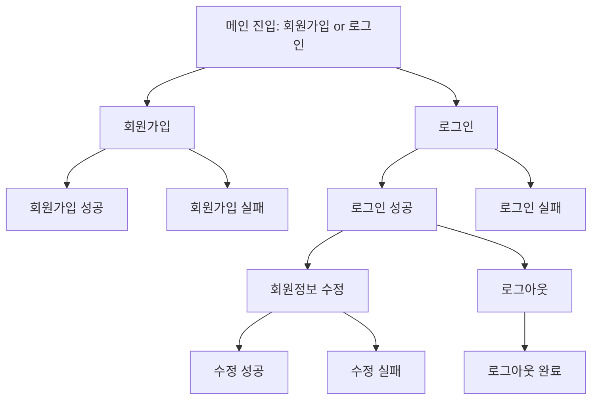
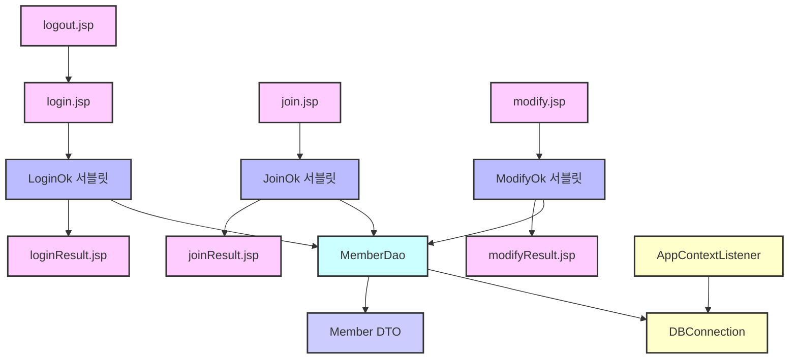

# JSP_19강

> 💡 목표: JSP 기반 회원 기능 구현 웹 프로젝트

## 작업 범위
- [x] 사용자 관리 기능
    - [x] 회원 가입
    - [x] 로그인
    - [x] 로그아웃
    - [x] 회원정보 수정
    - [x] 아이디 기억하기 (쿠키)
- [x] 화면 결과 처리
    - [x] 회원가입 성공/실패 화면
    - [x] 로그인 성공/실패 화면
    - [x] 회원정보 수정 성공/실패 화면
    - [x] 로그아웃 완료 화면
- [x] 부가 기능
    - [x] JDBC 드라이버 정상 해제 (AppContextListener 적용)
    - [x] 모든 화면 중앙 카드형 레이아웃 디자인 적용

## 실행 방법
1. DB 접속을 위한 `DBConnection.java` 수정
    - Oracle Cloud Wallet을 이용하여 DB 접속 설정
2. Maven 빌드
     - `pom.xml`에 `ojdbc11-full` 의존성 추가
3. Tomcat 서버 실행
4. 브라우저 접속
    - `http://localhost:8080/jsp_19_sgnr/join.jsp` → 회원가입 시작

## 실행 환경
- 운영체제: macOS Sequoia 15.3.1
- JDK 버전: OpenJDK 23.0.1
- 빌드 도구: Maven
- WAS: Apache Tomcat 11.0.6
- 데이터베이스: Oracle Cloud DB
- 외부 라이브러리: OJDBC11-full

## 프로그램 흐름

# 코드 구조

# 특이사항
- 쿠키 활용
    - 로그인 시 "아이디 기억하기" 기능 추가.
    - 쿠키(savedId)를 저장하여 로그인 화면에서 자동으로 ID를 입력.
- JDBC 드라이버 메모리 누수 방지
    - AppContextListener를 통해 웹애플리케이션 종료 시 JDBC 드라이버를 명시적으로 해제하여 서버 경고를 방지.
- 세션 기반 인증
    - 로그인 성공 시 세션에 member 객체 저장하여 인증 상태 유지.
- 디자인 통일
    - 로그인, 회원가입, 수정, 결과, 로그아웃 페이지 모두 카드형 중앙 레이아웃 적용.